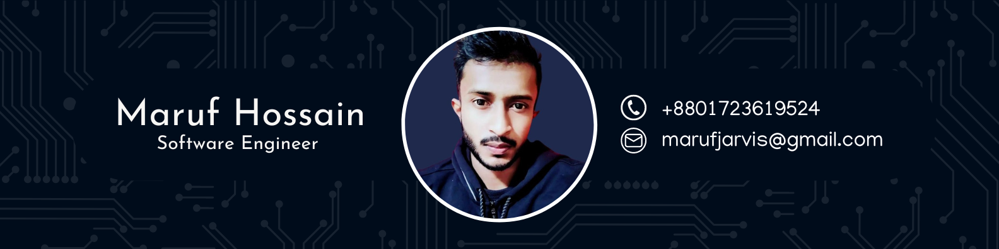

  
  
  
  
    

  
  
  
<em>Empowering innovation through Blockchain, AI, and Quantum Technology.</em>

  
  

    
    
    
  

---

  
  

---

## 🛠️ Tech Stack & Skills

  

---

## 🚀 Featured Projects (DApps, AI & Fullstack)

| Project | Description | Technologies |
| :--- | :--- | :--- |
| 🗳️ **VoteChain** | Quantum-resistant blockchain voting DApp | <kbd>#Blockchain</kbd> <kbd>#Quantum</kbd> <kbd>#DApp</kbd> |
| 🏥 **SmartCare** | AI health assistant for predictive diagnostics | <kbd>#AI</kbd> <kbd>#HealthTech</kbd> |
| 📚 **EduX App** | Feature-rich Flutter-based eLearning mobile app | <kbd>#Flutter</kbd> <kbd>#MobileApp</kbd> |
| 📈 **CryptoInsight** | Real-time crypto tracking platform with analytics | <kbd>#Blockchain</kbd> <kbd>#DeFi</kbd> |
| 📄 **AIResume** | Intelligent AI-based ATS resume analyzer | <kbd>#AI</kbd> <kbd>#Fullstack</kbd> |
| 💾 **DStor** | Decentralized file storage utilizing IPFS | <kbd>#Blockchain</kbd> <kbd>#DApp</kbd> <kbd>#Web3</kbd> |
| 🎨 **ArtChain** | Secure NFT marketplace for digital artists | <kbd>#NFT</kbd> <kbd>#Blockchain</kbd> |
| 🏦 **DeFiVault** | Decentralized lending and borrowing platform | <kbd>#DeFi</kbd> <kbd>#Blockchain</kbd> |
| 🆔 **GovID DAO** | Next-gen digital identity system with DAO mechanisms | <kbd>#DApp</kbd> <kbd>#Blockchain</kbd> |
| 🧠 **NeuroDAO** | Hybrid AI and DAO-based governance system | <kbd>#AI</kbd> <kbd>#Blockchain</kbd> |
| 🖥️ **E-Gov Admin Panel** | Comprehensive portal built for SRDL | <kbd>#Fullstack</kbd> <kbd>#WebDev</kbd> |
| 🔐 **QuantumWallet** | Crypto wallet with quantum-safe encryption | <kbd>#Quantum</kbd> <kbd>#Blockchain</kbd> |

---

## 🏛️ Government & Organization Projects
> *Leading national tech initiatives & digital transformation under the ICT Ministry of Bangladesh.*

<table>
  <tr>
    <td valign="top" width="50%">
      <ul>
        <li>🌐 <b>EDGE</b> (Enhancing Digital Government & Economy)</li>
        <li>📈 <b>ASSET</b> (Strengthening Skills for Transformation)</li>
        <li>💻 <b>SRDL</b> (Sheikh Russel Digital Lab)</li>
        <li>🏫 <b>School of Future</b> (Sheikh Russel School of Future)</li>
        <li>📱 <b>Cross-Platform App Dev</b> (ICT Ministry)</li>
        <li>💡 <b>Aspire to Innovate (a2i)</b></li>
      </ul>
    </td>
    <td valign="top" width="50%">
      <ul>
        <li>🎓 <b>Learning & Earning Project</b> (ICT Ministry)</li>
        <li>👩‍💻 <b>She Power / Her Power Projects</b> (ICT Ministry)</li>
        <li>🎮 <b>Skill Dev for Mobile Games & Apps</b> (ICT Ministry)</li>
        <li>🏗️ <b>National ICT Infrastructure Phase II</b></li>
        <li>🤝 <b>PTIB</b> (Inclusive Bangladesh Project)</li>
      </ul>
    </td>
  </tr>
</table>

---

## 💼 Global Experience

| 🇺🇸 North America | 🌍 Europe, Middle East & Africa | 🌏 Asia |
| :--- | :--- | :--- |
| **Scale AI** | **Peiko** (Tel Aviv, Israel) | **CyberCodex** (India) |
| **RAMP** (San Francisco) | **FatFish** (Jerusalem, Israel) | **Biz4 Solution** (India) |
| **Twitch** (Seattle) | **Petruskevich** (Haifa, Israel) | **Beta Source** (UAE) |
| **Asana** (New York City) | **Bles Software** (Gush Dan, Israel) | **Softpark IT** (Bangladesh) |
| **Archer** (San Jose) | **Plarium Israel** (Herzliya, Israel) | **Computer World** (Bangladesh) |
| **Blue Origin** (Seattle) | **BlackBelt Technology** (Budapest, Hungary) | **Digital IT Institute** (Bangladesh) |
| **Valve** (Bellevue) | **Cilo Global Resource** (South Africa) | |
| **Anthropic** | | |
| **IonQ** (Remote) | | |
| **Webflow** | | |
| **NationWide TFS LLC** (NY) | | |
| **Paragon** (Los Angeles) | | |

---

## 🎓 Education & 📜 Professional Certifications

<table>
<tr>
<td valign="top" width="50%">

### 🎓 Degrees
- **M.Sc in IT** ➔ *University of the People (UoPeople), USA*
- **M.Sc in Data Science & Machine Learning** ➔ *State University of Bangladesh (SUB)*
- **M.Sc in Mathematics** ➔ *National University, Bangladesh*
- **B.Sc in Mathematics** ➔ *National University, Bangladesh*

### 📊 Post Graduate Diplomas *(Guglielmo Marconi University, Italy)*
- **PGD in Data Science**
- **PGD in IHRM**
- **PGD in Blockchain Technology**

</td>
<td valign="top" width="50%">

### 🏅 Certifications
- `Certified IBM Qiskit V2.0x Developer`
- `Certified Blockchain Engineer` *(Blockchain Council)*
- `Certified Quantum Expert` *(Blockchain Council)*
- `Certified Hyperledger Developer™` *(Blockchain Council)*
- `Certified Ethereum Developer™` *(Blockchain Council)*
- `Certified Polygon Developer™` *(Blockchain Council)*
- `Certified Solidity Developer®` *(Blockchain Council)*
- `Certified MERN Developer` *(Ostad)*
- `Certified Flutter Developer` *(Ostad)*
- `Certified Web App Developer` *(Geta University, India)*
- `Certified Web App Developer` *(LICT Project, ICT Ministry)*
- `Certified Associate Android Developer` *(Google)*
- `Master Trainer` *(NSDA, SEIP, PKSF, CBT&A, TVET)*

</td>
</tr>
</table>

---

  
<em>Maruf Hossain is a multi-disciplinary software engineer specializing in Blockchain, AI, Quantum Computing, and Fullstack technologies. He has worked with international companies and led several national tech projects in Bangladesh.</em>

  
  

