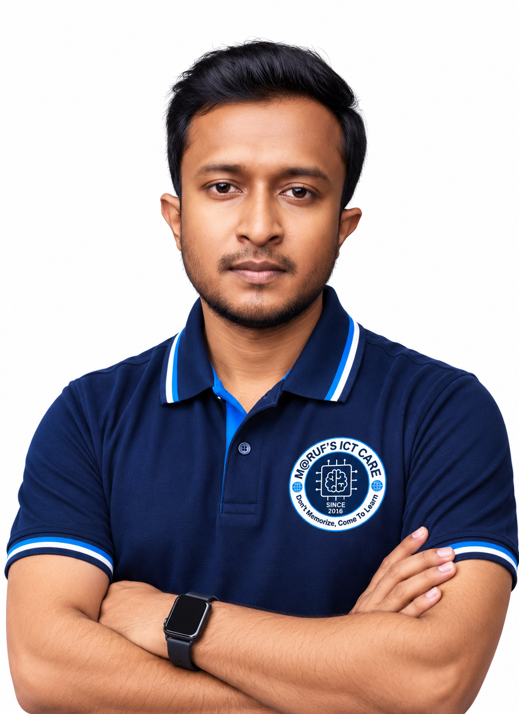

  
  <h1>👨‍💻 Maruf Hossain</h1>
  
<b>AI Engineer | Fullstack Blockchain Developer | Quantum Expert | Fullstack Software Engineer</b>

  
Welcome to my digital workspace! I specialize in bridging the gap between cutting-edge technologies like <b>Quantum Computing</b>, <b>Artificial Intelligence</b>, and <b>Decentralized Systems (Blockchain)</b>, while delivering robust <b>Fullstack</b> applications.

  
  

    
    
    
  

---

## ⚡ Technical Arsenal

---

## 🚀 Key Projects & Innovations

### ⚛️ Next-Gen Technology (Web3, AI, Quantum)
- 🗳️ **VoteChain:** Quantum-resistant blockchain voting DApp.
- 🔐 **QuantumWallet:** Crypto wallet featuring quantum-safe encryption.
- 🏥 **SmartCare:** AI-driven health assistant for predictive diagnostics.
- 🎨 **ArtChain & DStor:** NFT marketplace & IPFS decentralized storage solutions.
- 🏦 **DeFiVault:** Decentralized lending & borrowing protocol.
- 🧠 **NeuroDAO:** Hybrid AI and DAO-based governance system.
- 📄 **AIResume:** Intelligent AI-based ATS resume analyzer.
- 📈 **CryptoInsight:** Real-time crypto tracking platform with DeFi analytics.

### 🏛️ National Digital Transformation (Bangladesh ICT Ministry)
> *Leading and architecting massive national infrastructure and digital inclusion initiatives.*
- 🌐 **EDGE** (Enhancing Digital Government & Economy)
- 📈 **ASSET** (Strengthening Skills for Transformation)
- 💻 **SRDL** (Sheikh Russel Digital Labs) & **School of Future**
- 🎓 **Learning & Earning / Her Power** (IT empowerment for women and youth)
- 💡 **Aspire to Innovate (a2i)** (Digital Services Integration)
- 📱 **Cross-Platform App Dev** & **Skill Dev for Mobile Games** (ICT Ministry)

### 💻 Enterprise Fullstack & Mobile
- 📚 **EduX App:** Feature-rich Flutter-based eLearning mobile platform.
- 🖥️ **E-Gov Admin Panel:** Comprehensive, scalable portal built for SRDL.

---

## 🌍 Global Experience Footprint

| 🌎 **North America** | 🇪🇺 **EMEA** (Europe, Middle East, Africa) | 🌏 **Asia** |
| :--- | :--- | :--- |
| **Scale AI** | **Peiko** (Tel Aviv, Israel) | **CyberCodex** (India) |
| **RAMP** (San Francisco) | **FatFish** (Jerusalem, Israel) | **Biz4 Solution** (India) |
| **Twitch** (Seattle) | **Petruskevich** (Haifa, Israel) | **Beta Source** (UAE) |
| **Asana** (New York City) | **Bles Software** (Gush Dan, Israel) | **Softpark IT** (Bangladesh) |
| **Archer** (San Jose) | **Plarium Israel** (Herzliya, Israel) | **Computer World** (Bangladesh) |
| **Blue Origin** (Seattle) | **BlackBelt Technology** (Budapest, Hungary) | **Digital IT Institute** (Bangladesh) |
| **Valve** (Bellevue) | **Cilo Global Resource** (South Africa) | |
| **Anthropic** | | |
| **IonQ** (Remote) | | |
| **Webflow** | | |
| **NationWide TFS LLC** (NY) | | |

---

## 🎓 Academic & Professional Credentials

### 📜 Degrees & Diplomas
- **M.Sc in IT** — *University of the People (UoPeople), USA*
- **M.Sc in Data Science & Machine Learning** — *State University of Bangladesh (SUB)*
- **M.Sc in Mathematics** — *National University, Bangladesh*
- **B.Sc in Mathematics** — *National University, Bangladesh*
- **PGD in Data Science, IHRM, & Blockchain Technology** — *Guglielmo Marconi University, Italy*

### 🏅 Top Certifications
- `Certified IBM Qiskit V2.0x Developer`
- `Certified Blockchain Engineer` & `Certified Quantum Expert` *(Blockchain Council)*
- `Certified Hyperledger, Ethereum, Polygon & Solidity Developer` *(Blockchain Council)*
- `Certified MERN & Flutter Developer` *(Ostad)*
- `Certified Associate Android Developer` *(Google)*
- `Master Trainer` *(NSDA, SEIP, PKSF, CBT&A, TVET)*

---

  
  
  
   
  

